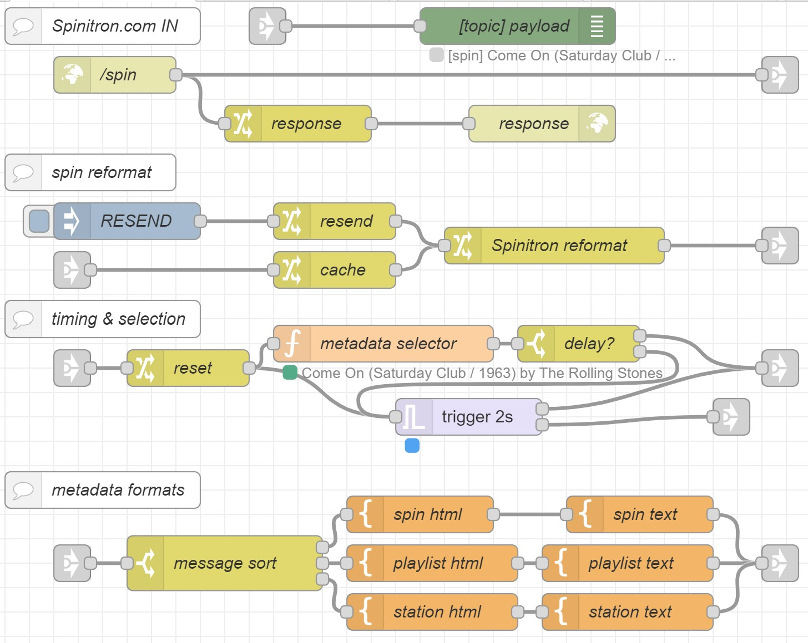

# node-red-station-spinitron
  Node-RED flow for interepreting a Spinitron.com metadata push channel.

  The flow.json file contains export of a Node-RED flow used to parse Spinitron "metadata push channel" output to create a real-time reperesntation of the current contents of an aural program or stream.  The flow will create a payload output during music and non-music output with an appropriate content.
  
  

# Method
  The flow utilizes the stock HTTP IN node to create an HTTP endpoint server.  In order to accept data from Spinitron, this endpoint does need to be exposed to the internet.  

  Please follow instructions on [Securing Node-RED](https://nodered.org/docs/user-guide/runtime/securing-node-red) prior to exposing your endpoint to the Internet. 

  Once configured and secured, A Spinitron admin for your station will need to configure a Spinitron.com metadata push channel as follows:

  `POST https://%un%:%pw%@<your URL>/<your ENDPOINT>?now=%now%&message_count=%ct%&message_valid_duration=%rdur%&spin_id=%si%&spin_time=%sp%&spin_duration_seconds=%sd%&spin_note=%se%&artist=%an%&title=%sn%&composer=%sc%&new=%ne%&request=%rq%&album_title=%dn%&format=%df%&year=%dr%&coverart_url=%ua%&genre=%dl%&local=%lo%&label=%ln%&station_title=%st%&host=%dj%&show_id=%wi%&playlist=%wn%&playlist_id=%pi%&playlist_category=%wc%&playlist_since_year=%ws%&playlist_description=%wd%&playlist_start=%wo%&playlist_end=%wf%&show_weekdays=%ww%&spin_url=%tsp%&host_url=%tdj%&show_url=%tsh%&station_url=%tst%`

  Don't forget to replace \<your URL\> and \<your ENDPOINT\> with the proper information.  The default included in the flow is /spin. The Username and Password fields will need to be filled with the credentials established for your endpoint as outlined in the Securing Node-RED document.  Default Duration and Max Duration will directly apply to the output. Default duration will be the default song length for any spins entered without this field filled by the host.

# Verification
  The flow combines an HTTP endpoint node with a change node and an HTTP Response node to complete the Hypertext transaction. The default "Spin OK!" text from the change node will be the data returned from Node-RED to the Spinitron.com metadata channel.  If the Spinitron.com metadata channel successfully delivers the HTTP Post data to the endpoint, the Spinitron.com metadata push logs will show a timestamp along with a "200" response code and an "OK" status.
  
  